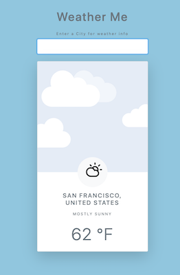
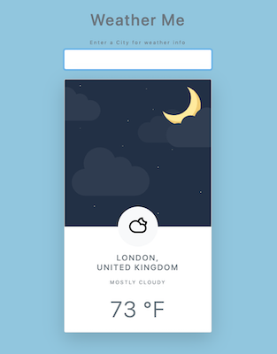

# Weather Me

> Running Live at: https://weather-me-app.firebaseapp.com

## What is it?

Weather Me is a current weather forecasting app that queries the AccuWeather API for current weather conditions based on City name and the Weather Condition within that City.

---

## Features

Weather Me features include dynamically/asynchronously delivered content based on user input. This includes dynamically rendered Daytime/Nighttime imagery, current weather icon based on 40 different associated weather types in the AccuWeather API, as well as location and weather text info. Hosted through Firebase Hosting.

### Built with:

- HTML5
- CSS3
- JavaScript
- Firebase Hosting

### Implemented Functional Features:

- [x] Search by City name
- [x] Location/Weather Information
- [x] Dynamically rendered weather icons/imagery
- [x] Search persistence

### Roadmap for Development:

- [ ] Modify search input/query to API to increase location accuracy
- [ ] Current Search Time
- [ ] Create a Favorites and/or History bar to allow for easily repeatable searches
- [ ] Add in extended forecast features of 3-Day / 10-Day
- [ ] Possibly add in Live Weather Radar for locale
- [ ] Share info/Social Media/Messaging features
- [ ] Login/User Authentication
- [ ] Friends Lists
- [ ] Tagging to create relationships

---

## ScreenShots

- Initial State:  
  
- Daytime Weather:  
  
- Nighttime Weather:  
  

---

## Author

- Joshua Jimenez, [Personal Site](https://bigjoshcodes.dev) | [Github: jsjimenez51](https://github.com/jsjimenez51) | [Twitter: @bigjoshcodes](https://twitter.com/bigjoshcodes)
